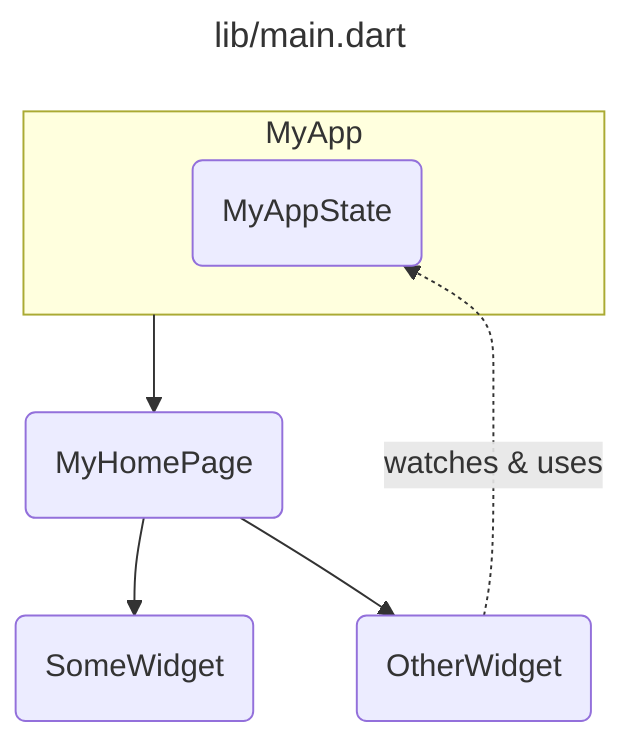

```mermaid
---
title: lib/main.dart
---
flowchart
    subgraph "MyApp"
        State("MyAppState")
    end

    Home("MyHomePage")
    Some("SomeWidget")
    Other("OtherWidget")
    
    MyApp --> Home
    Home --> Some
    Home --> Other

    Other -.->|watches & uses| State
```