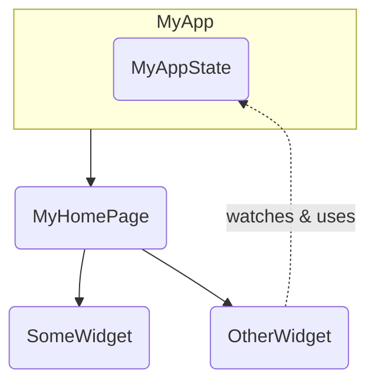

# pubspec.yaml

```yaml
name: namer_app
description: A new Flutter project.

publish_to: 'none' # Remove this line if you wish to publish to pub.dev

version: 0.0.1+1

environment:
  sdk: '>=2.19.4 <4.0.0'

dependencies:
  flutter:
    sdk: flutter

  english_words: ^4.0.0
  provider: ^6.0.0

dev_dependencies:
  flutter_test:
    sdk: flutter

  flutter_lints: ^2.0.0

flutter:
  uses-material-design: true
```

- `pubspec.yaml` 파일은 앱에 관한 기본 정보(예: 현재 버전, 종속 항목, 함께 제공될 에셋)를 지정한다.

# analysis_options.yaml

```yaml
include: package:flutter_lints/flutter.yaml

linter:
  rules:
    prefer_const_constructors: false
    prefer_final_fields: false
    use_key_in_widget_constructors: false
    prefer_const_literals_to_create_immutables: false
    prefer_const_constructors_in_immutables: false
    avoid_print: false
```

- 이 파일은 코드를 분석할 때 Flutter의 엄격성 정도를 결정한다.

# lib/main.dart

## main()

```dart
void main() {
  runApp(MyApp());
}
```

- `MyApp`에서 정의된 앱을 실행하라고 Flutter에 지시한다.

## MyApp

```dart
class MyApp extends StatelessWidget {
  const MyApp({super.key});

  @override
  Widget build(BuildContext context) {
    return ChangeNotifierProvider(
      create: (context) => MyAppState(),
      child: MaterialApp(
        title: 'Namer App',
        theme: ThemeData(
          useMaterial3: true,
          colorScheme: ColorScheme.fromSeed(seedColor: Colors.deepOrange),
        ),
        home: MyHomePage(),
      ),
    );
  }
}
```

- `StatelessWidget`을 확장한다.
- 위젯은 모든 Flutter 앱을 빌드하는 데 사용되는 요소이다.
- `MyApp`의 코드는 전체 앱을 설정한다.
- 앱 전체 상태를 생성하고 앱의 이름을 지정하고 시각적 테마를 정의하고 '홈' 위젯(앱의 시작점)을 설정한다.

## MyAppState

```dart
class MyAppState extends ChangeNotifier {
  var current = WordPair.random();
}
```

- `MyAppState`는 앱의 상태를 정의한다. 앱이 작동하는 데 필요한 데이터를 정의한다.
- 상태클래스는 `ChangeNotifier`를 확장한다. 즉, 자체 변경사항에 관해 다른 항목에 알릴 수 있다. 예를 들어 현재 단어 쌍이 변경되면 앱의 일부 위젯이 이를 알아야 한다.
- 상태가 만들어지고 `ChangeNotifierProvider`를 사용하여 전체 앱에 제공된다. 이렇게 하면 앱의 위젯이 상태를 알 수 있다.



## MyHomePage

```dart
class MyHomePage extends StatelessWidget {
  @override
  Widget build(BuildContext context) {           // ← 1
    var appState = context.watch<MyAppState>();  // ← 2

    return Scaffold(                             // ← 3
      body: Column(                              // ← 4
        children: [
          Text('A random AWESOME idea:'),        // ← 5
          Text(appState.current.asLowerCase),    // ← 6
          ElevatedButton(
            onPressed: () {
              print('button pressed!');
            },
            child: Text('Next'),
          ),
        ],
      ),
    );
  }
}
```

1. 모든 위젯은 위젯이 항상 최신 상태로 유지되도록 위젯의 상황이 변경될 때마다 자동으로 호출되는 `build()` 메서드를 정의한다.
2. `MyHomePage`는 `watch` 메서드를 사용하여 앱의 현재 상태에 관한 변경사항을 추적한다.
3. 모든 `build` 메서드는 위젯 또는 중첩된 위젯 트리를 반환해야 한다. 여기서 최상위 위젯은 `Scaffold`이다.
4. `Column`은 Flutter에서 가장 기본적인 레이아웃 위젯 중 하나이다. 하위 요소를 원하는 대로 사용하고 이를 위에서 아래로 열에 배치한다. 기본적으로 열은 시각적으로 하위 요소를 상단에 배치한다. 열이 중앙에 위치하도록 이를 곧 변경한다.
5. 첫 번째 단계에서 이 `Text` 위젯을 변경했다.
6. 이 두 번째 `Text` 위젯은 `appState`를 사용하고 해당 클래스의 유일한 멤버인 `current`(즉, `WordPair`)에 엑세스한다. `WordPair`는 `asPascalCase` 또는 `asSnakeCase` 등 여러 유용한 `getter`를 제공한다.
